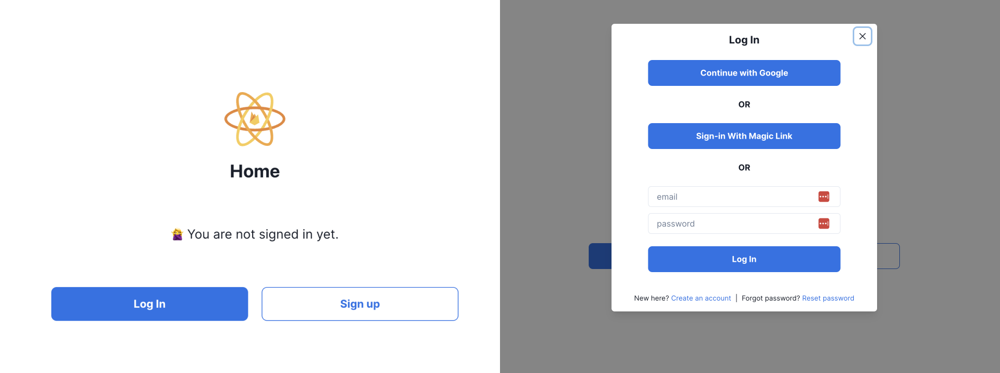

# 🚀 Starter Next.js App With Firebase Auth

This repo is a starter to initialize a Next.js application with a fully functional authentication system using Firebase v9, using TypeScript, React & Jotai.

Feel free to clone or fork this repo to kickstart your next project in minutes 🔥

If you're interested in learning the concepts used in this repo, I wrote a complete guide to set up and manage auth in a React application with Firebase and Jotai. I will add the link here when it's published.

**☝️ This project would be better suited for production with tests. I will add those incrementally. Stay tuned.**

<br />

## Features
- Sign-up/sign-in with email/password
- Sign-in with Google
- Sign-in with magic link
- Reset password
- Sign out
- Add/remove user in Firestore on account creation/deletion with Firebase Cloud Functions
- Auth modal state management with Jotai

<br />

## Getting Started

1. Clone this repo and install the dependencies:
```bash
npm install
# or
yarn install
# or
pnpm install
```
<br />
2. Create a new project in Firebase and set it up for Firebase Auth, Functions and Firestore.

<br />

3. Set the environment variables
Copy the `.env.example` into a `.env.local` file and set each variable with your own values.

<br />

4. Install the Firebase CLI
```bash
npm install -g firebase-tools
# or
yarn global add firebase-tools
# or
pnpm add -g firebase-tools
```

<br />

5. Deploy the Firebase Cloud Functions
```bash
firebase deploy --only functions
```

<br />

6. Run the development server:

```bash
npm run dev
# or
yarn dev
# or
pnpm dev
```

Open [http://localhost:3000](http://localhost:3000) with your browser to see the result.

<br/>



<br/>

Enjoy!